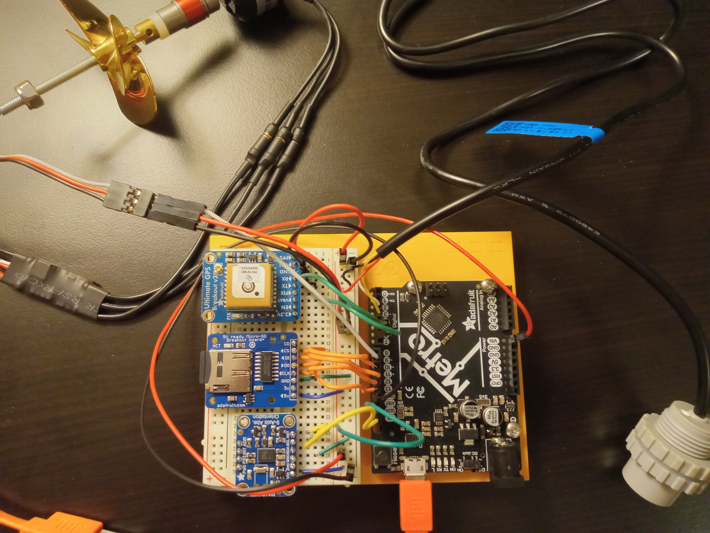
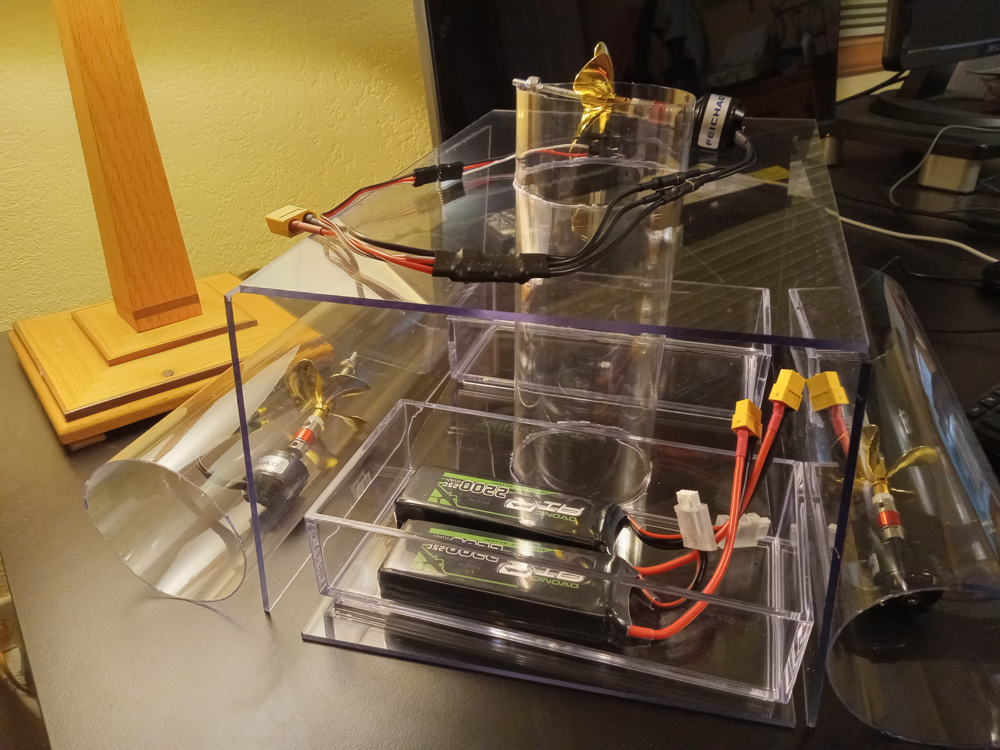

# StormFin
underactuated fish finder
# ChibbComm
raspberry pi land communicator and StormFin controller

## motivation
avoiding $1500+ Garbin LiveScope Plus \
current state of the art is forward facing sonar \
steerable transducer on trolling motor, 20 deg sonar beam, 100 ft range \
proposal - AUV tracking




## microcontroller board
Adafruit METRO 328 / Arduino Nano Complementary Filtering on-board \
Embedded EKF would require STM32H7 (for example), CMSIS-DSP library, etc. \
Arduino Due (84MHz 32-bit ARM Cortex-M3 processor, 96KB SRAM) would struggle with EKF \

## bill of materials
    1. SP17 IP68 10 pin waterproof connectors
    2. A2212 930KV brushless motors
    3. 55mID 60mmOD 4 blade propellers
    4. DFRobot IP68 6m UART ultrasonic sensor
    5. BNO055 IMU sensor
    6. ATmega 328P
    7. 3S LiPo Battery (11.1V) with charger
    8. GLONASS + GPS PA1616D - 99 channel w/ 10Hz
    9. ESC (20A) with BEC speed controller
    10. 64MB microSD
    11. Raspberry Pi Model B+
    12. UBEC DC/DC Step-Down (Buck) Converter - 5V @ 3A output
    13. B6AC 80W Balance Charger

## software overview
```mermaid
classDiagram
    Controller ..> Filter
    Controller ..> Sensors
    Controller ..> Thrusters
    Controller ..> Collocation
    Controller ..> Utilities
    Controller ..> DataStore
    Filter ..> Utilities
    Filter ..> GSLWrappers
    Filter ..> LaminarModel
    Filter : +void initialize_state()
    Filter : +void process(double, double*, double*, double*, double*)
    Filter : +void estimate_measurements(double*, double*)
    Filter : +void update(double*)
    Sensors : +void qrot_pure(double*, double*)
    Sensors : +void body_to_nav(double*, double*, double*)
    Sensors : +void set_qrot(double*)
    Sensors : +void qrot_pure(double*, double*)
    Sensors : +void ultrasonic_distance(double)
    Thrusters : +void thrust_to_pwm(double*, double*)
    Collocation : +void optimal_thrust(double*, double*, int, double*)
    Utilities : 
    GSLWrappers : 
    DataStore : 
```

## test plan
    1. prototype
    2. grid test xy filtered position and orientation
    3. ultrasonic stop when target acquired
    4. ultrasonic circling thrust default
    5. ultrasonic stalk, throttle when target receeding
    6. submersible (no power)
    7. pool test
    8. lake test (laminar no current)
    9. river test (laminar current)

## TODO
    1. insufficient memory for iostream, stdlib explicitly included
    2. GSL for off-board EKF testing / validation
    3. use DMA (Direct Memory Access) for sensor inputs rather than analogRead()
