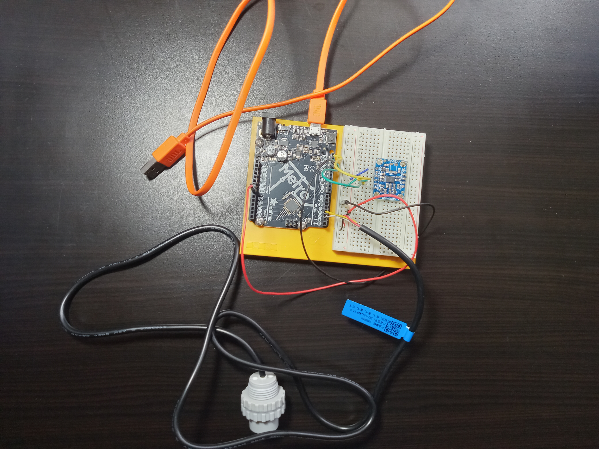

# stormfin
underactuated fish finder

Arduino Due
84MHz 32-bit ARM Cortex-M3 processor, 96KB SRAM

Currently prototyping using GSL
insufficient memory for iostream, stdlib explicitly included
TODO: 
use arduino BasicLinearAlgebra
use DMA (Direct Memory Access) for sensor inputs rather than analogRead()
